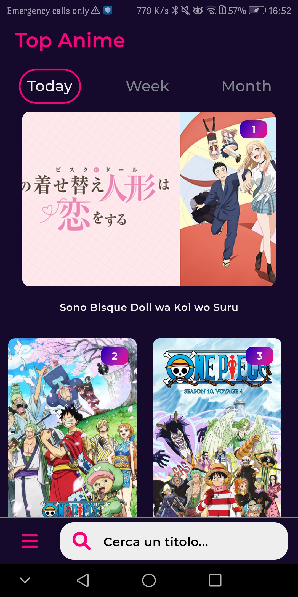
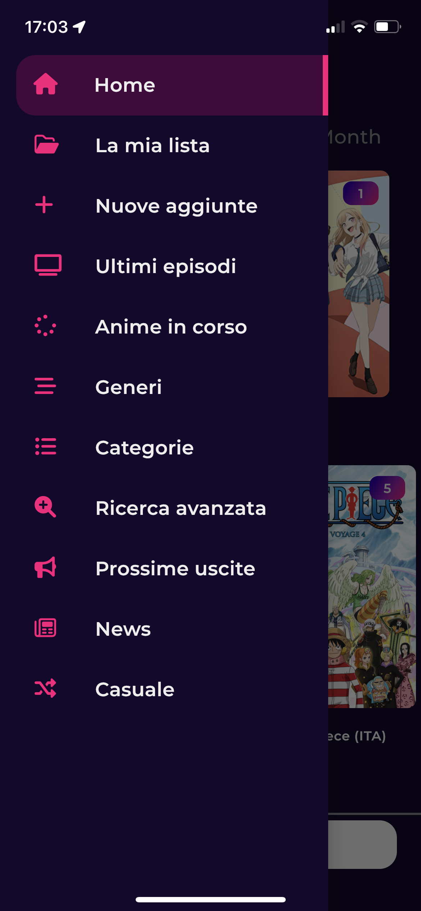
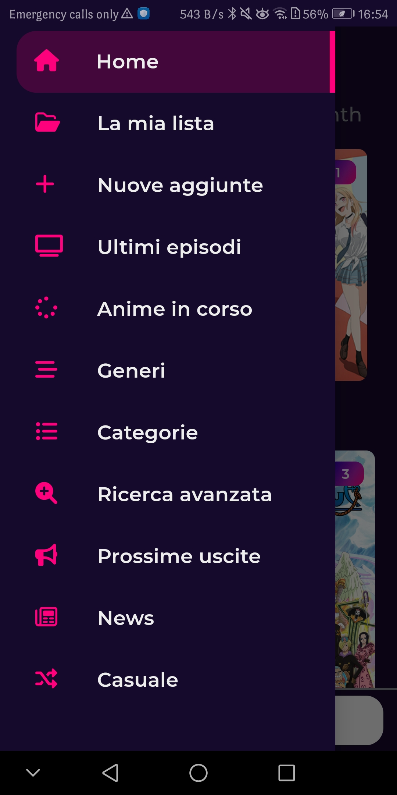
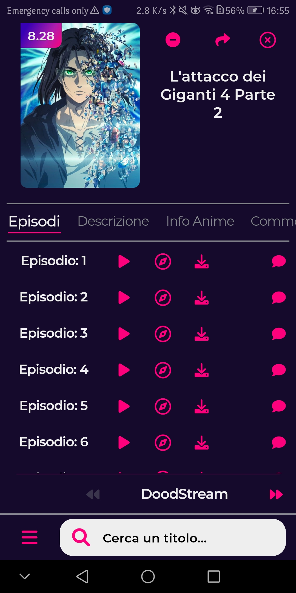
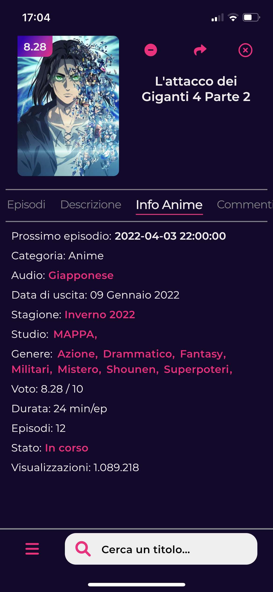
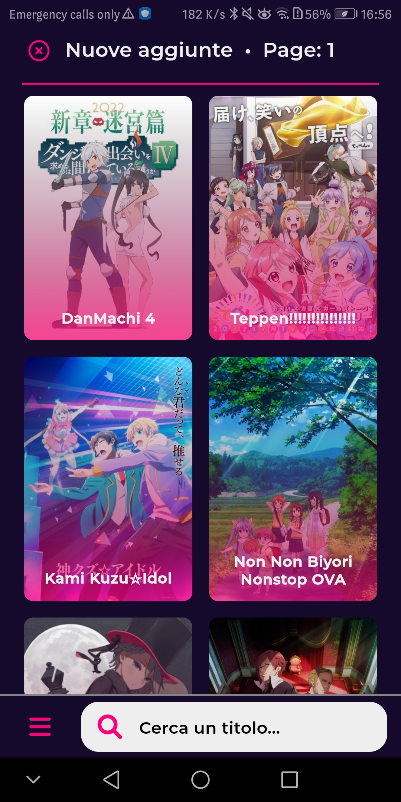

# Miru Anime

Miru Anime is made with Flutter with the porpoise for viewing sub or dub italian anime.
The main target of the application is the iOS platform (15.0 or above) but it work with completely fine 
also with android (Android 8.0 or above).

## Features: 

Remember that's built with the idea to support only iOS 15.0 or Android 8.0 and above and for reduce 
the installation space, but if you want to install on old device you can clone build on your own with 
Xcode or Android Studio and change the target version; Maybe you will need to change some plugin setup.

This app support video's download (with .mp4 type, not .m3u8) so if you desire to download video
you should activate notifications to now about the download status.
When the download is completed you should find the file on the Miru Anime's folder inside "iPhone" folder on
iOS Phones or in the Download folder on Android 10 or above or inside the app's folder (org.loli.miruAnime) 
on "Android" folder if the user has android 8.0, 8.1 or 9.

The app has also a built-in database with Objectbox to store so the user can add anime that he is watching,
the db contains the last episode watched and if the user has finished it. (But you should only to keep track
of the anime you currently watching and then save your progress in another app or site, like My Anime List,
because app upgrade might corrupt the db).

#### Current features:

- Support Animeworld (italian website)
- Download anime if the video is .mp4
- Internal database
- Share link of anime
- Open video with external app

### How the app looks like:
 
iOS Platform           |  Android Platform  
:-------------------------:|:-------------------------:
  |  
  |  
  |  
  |  
  |  
  |  

### Disclaimer

This app is made only for fun and for learning flutter and the process of make a mobile application,
if this app violate some copyrights you should contact me so i can remove this application.

